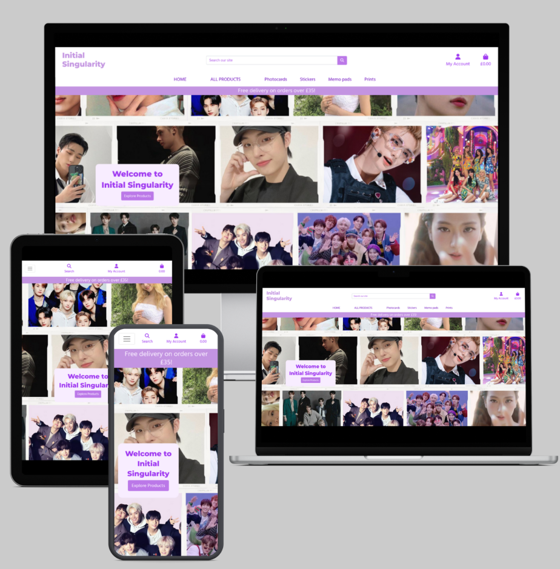

# Initial Singularity - Your K-Pop Inspired E-commerce Platform
Welcome to Initial Singularity – more than just a shop, it's a creation born out of pure fandom and dedication. For fans, by a fan, every product is lovingly crafted at home by the owner. Drawing inspiration from the captivating world of K-Pop (Korean Pop Music), Initial Singularity aims to bridge the gap caused by the expensive prices of official merchandise, making it affordable for every K-Pop enthusiast out there.

At Initial Singularity, I understand the magic of being a fan, and I want to enhance that experience by offering affordable and high-quality products that celebrate the K-Pop culture. Join me on this journey as we create a community of passionate fans who wear their love for K-Pop with pride!

* Key features
   - User Authentication and Profiles: Users can create accounts, log in, and log out. Users have access to their order history, and they can view details of past orders.
   - Search and Filtering: There's a search feature allowing users to search for products by name or description. Users can also filter products by category.
   - Admin Interface: Admins can view and manage orders, including order line items.
   - Stripe checkout: Users can place an order on the website using Stripe.
---

[View deployed site here](https://initialsingularity-9ff73d5f222f.herokuapp.com/)
---

## Table of Contents
- [About](#about)
- [UX](#ux)
  - [Ideal Client](#ideal-client)
  - [Client Stories](#client-stories)
- [Features](#features)
  - [Existing Features](#existing-features)
  - [Features Left to Implement](#features-left-to-implement)
- [Wireframes](#wireframes)
- [Design](#design)  
  + [Colour Scheme](#colour-scheme)
- [Testing](./Testing.md)
- [Database](#Database-Schema)
- [Deployment](#deployment)
- [Media](#media)
## About

The goals of this website are:
* Showcase and Sell Products: 
      The primary goal of the website is to serve as an online platform to showcase and sell the handcrafted products inspired by K-Pop. 

* Provide Product Information: 
      Each product have a detailed descriptions, high-quality images to give potential buyers a clear understanding 
      of what they're purchasing. This information helps build trust and encourages users to make informed decisions.

* Implement Secure Payment Processing:
      As the website handles financial transactions, ensuring a secure payment gateway is of utmost importance. It builds trust and reassures 
      customers that their personal and financial information is protected.

# UX
## Ideal client
### Initial Singularity caters to the following ideal visitor:
 
* K-Pop Enthusiasts: The website is specifically designed for individuals who are passionate about K-Pop and have a deep interest in the Korean pop music culture. These fans are likely to be familiar with various K-Pop artists, groups, and trends.

* Affordable Merchandise Seekers: The website caters to fans who appreciate high-quality, handcrafted products inspired by K-Pop but may find official merchandise to be too expensive. These visitors are looking for affordable alternatives without compromising on the fandom experience.

* Frequent Online Shoppers: The ideal visitor is likely to be comfortable with online shopping and enjoys browsing and purchasing products from e-commerce platforms. They are tech-savvy and expect a smooth, user-friendly online shopping experience.

* International Audience: As K-Pop has a global following, the website should appeal to fans from various countries and cultures who share a common interest in Korean pop music.

* Value-Conscious Buyers: The ideal visitor appreciates the value of handcrafted products and seeks to support independent creators while obtaining products that fit their budget.

Overall, the ideal visitor for the Initial Singularity website is a dedicated K-Pop enthusiast who is looking for an affordable and community-driven shopping experience, accompanied by unique and high-quality products inspired by their favorite music genre.

### Client stories

| User Story ID | As a | I want to... | So that I can... |
|---------------|------|--------------|-------------------|
| 1             | New User | Create an account | Save my profile information. |
| 2             | Registered User | Log in securely | Perform actions such as adding products to my shopping bag and placing orders. |
| 3             | User | View a list of available products | Browse through the different products |
| 4             | User | Click on a product | See its detailed description, price, and image for a better understanding before making a purchase decision. |
| 5             | User | Search for specific products | Quickly find items I'm interested in. |
| 6             | User | Filter products | Find products more easily by categories, sort criteria, and sorting order. |
| 7             | User | Add products to my shopping bag | Specify the quantity and see the total price of items in my shopping bag. |
| 8             | User | View and manage the contents of my shopping bag | Adjust item quantities, remove items, or proceed to checkout. |
| 9             | User | Proceed through a secure and intuitive checkout process | Provide necessary shipping and payment information before finalizing my order. |
| 10            | User | View a history of my previous orders | See order details |
| 11            | Registered User | Manage my profile information | Update contact details and default shipping address. |
| 12            | Admin User | Add, edit, and delete products from the catalog | Keep the product listings up-to-date and accurate. |
| 13            | Admin User | View and manage orders | Update order details and product quantity |

## Features 
### Existing Features

1. **User Registration and Authentication**: Users can create accounts, log in, and log out.

2. **Product Listings**: Display a catalog of products, each with detailed descriptions, images, and prices.

3. **Product Search and Filters**: Allow users to search for products by keywords and apply filters to narrow down their choices.

4. **Shopping Cart**: Users can add products to their cart, view the contents, and proceed to checkout.

5. **Checkout Process**: A step-by-step process for users to enter shipping details, select payment methods, and complete their orders.

6. **Payment Integration**: Integration with a secure payment gateway to process payments.

7. **Order History**: Users can view their order history, including order number and details.

8. **Responsive Design**: Ensuring the website is usable and looks good on various devices (desktop, tablet, mobile).

9.  **Security Measures**: Implementation of security best practices to protect user data and payment information.

10. **Navigation Menu and Layout**: A structured layout with a navigation menu for easy access to different sections of the website.

## Features Left to Implement

1. **International Shipping Prices**: Display transparent international shipping costs.

2. **Product Reviews**: Allow customers to leave reviews and ratings for products.

3. **Customer Support Section**: Add a customer support section with additional resources and FAQs.

4. **Community Blog**: Add a blog to build a community and share K-Pop-related content.

# Wireframes

[You can find the wireframes here](./docs/wireframes/wireframes.pdf)

# Design

## Colour Scheme.
I have decided to go with different shades of purple since it has become associated with the K-pop industry and fan culture, but it's not inherently related to K-pop itself. Instead, the association between purple and K-pop has developed over time due to its popularity among K-pop fans and its frequent use by K-pop artists and fan communities. Here's why purple is often linked to K-pop:

**Purple Hearts** :K-pop fans commonly use purple heart emojis (💜) to express their love and support for their favorite artists. The purple heart symbolizes admiration, affection, and unity within the K-pop fan community.

**Fandom Colors**: Some K-pop groups have designated official fandom colors, and purple is occasionally chosen as one of these colors. When a fandom adopts purple as its color, it becomes a unifying symbol for fans to identify with.

**Lightsticks and Concerts**: At K-pop concerts, fans often use lightsticks that emit purple light. These lightsticks are synchronized with the music and stage lighting, creating a visually stunning and immersive concert experience. Purple light is associated with fan enthusiasm and excitement.

**Fan Art and Fan Projects**: K-pop fans create fan art, banners, and projects that prominently feature purple as a way to show support for their favorite artists. These projects are often displayed during concerts or fan events.

**Social Media Trends**: Purple is a trending color on social media platforms among K-pop fans. Fans use purple-themed profile pictures, hashtags, and emojis to celebrate their favorite artists and interact with the K-pop community.

# Database Schema

The database for our application is structured as follows:

## Tables

### 1. Users

   - **Description**: The Users table stores information about registered users of our application.
   - **Columns**:
        - `user_id` (Primary Key): Unique identifier for each user.
        - `username`: User's username (unique).
        - `email`: User's email address (unique).
        - `password_hash`: Hashed password for authentication.
        - `created_at`: Timestamp of user registration.

### 2. Products

   - **Description**: The Products table contains information about the products available in our catalog.
   - **Columns**:
        - `product_id` (Primary Key): Unique identifier for each product.
        - `name`: Product name.
        - `description`: Product description.
        - `price`: Product price.
        - `category`: Product category.
        - `image_url`: URL to the product image.

### 3. Orders

   - **Description**: The Orders table records details of user orders.
   - **Columns**:
        - `order_id` (Primary Key): Unique identifier for each order.
        - `user_id` (Foreign Key): References the user who placed the order.
        - `order_date`: Date and time of the order.
        - `total_amount`: Total order amount.
        - `payment_method`: Payment method used for the order.

### 4. OrderItems

   - **Description**: The OrderItems table stores individual items within an order.
   - **Columns**:
        - `order_item_id` (Primary Key): Unique identifier for each order item.
        - `order_id` (Foreign Key): References the order to which the item belongs.
        - `product_id` (Foreign Key): References the product in the order.
        - `quantity`: Quantity of the product in the order.
        - `subtotal`: Subtotal cost of the item within the order.

## Relationships

   - The Users table is related to the Orders table through the user_id foreign key.
   - The Products table is related to the OrderItems table through the product_id foreign key.
   - The Orders table is related to the OrderItems table through the order_id foreign key.

## Constraints

   - Usernames and email addresses in the Users table are unique to ensure no duplicate user accounts.
   - Foreign key constraints ensure data integrity by linking related records in different tables.
   - Proper indexing is used for efficient data retrieval.

## W3 Validation Issues

In the development of this project, I encountered and addressed various W3 validation issues. Below are some of the issues that have been fixed:

### 1. Viewport Value Error

**Error Message:** Consider avoiding viewport values that prevent users from resizing documents.

**Explanation:** This error occurs in line 11, column 9 to line 11, column 95. It suggests that the viewport settings may prevent users from resizing the document.

---

### 2. Element li Not Allowed in nav

**Error Message:** Element li not allowed as a child of element nav in this context.

**Explanation:** This error occurs in multiple places where the `<li>` element is used within a `<nav>` element. According to HTML5 specifications, the `<li>` element is not allowed as a direct child of the `<nav>` element in this context.

---

### 3. Duplicate ID user-options

**Error Message:** Duplicate ID user-options.

**Explanation:** This error indicates that there are duplicate HTML elements with the same `id` attribute value "user-options." It can cause unexpected behavior when accessing elements by their `id`.

---

### 4. Duplicate Attribute class

**Error Message:** Duplicate attribute class.

**Explanation:** This error occurs when multiple HTML elements have duplicate `class` attributes with the same value. Duplicate attributes should be avoided to ensure clean and maintainable code.

---

### 5. Unclosed Elements

**Error Message:** End tag li seen, but there were open elements. / Unclosed element div.

**Explanation:** These errors indicate that certain HTML elements (e.g., `<li>`, `
`) are not properly closed, resulting in unclosed elements. Properly closing elements is essential to maintain the document's structure.

---

### 6. Illegal Character in href Attribute

**Error Message:** Bad value /products/?category=Memo pads for attribute href on element a: Illegal character in query: space is not allowed.

**Explanation:** This error points out that the `href` attribute of an anchor `<a>` element contains illegal characters, specifically spaces. URLs should not contain spaces; consider encoding them as `%20`.

---

### 7. Stray end tag nav

**Error Message:** Stray end tag nav.

**Explanation:** This error occurs when an `</nav>` end tag is found without a corresponding opening `<nav>` tag. It suggests that there may be issues with the nesting of HTML elements.

---

### 8. Unnecessary type Attribute

**Error Message:** The type attribute is unnecessary for JavaScript resources.

**Explanation:** This warning advises that the `type` attribute is unnecessary for including JavaScript resources. The browser can typically infer the script type, so the `type` attribute can be omitted.

---

### 9. Unclosed div Element

**Error Message:** Unclosed element div.

**Explanation:** This error indicates that a `
` element is not properly closed. Make sure to close all `
` elements to maintain the structure of the HTML document.

---

### 10. End tag for body seen

**Error Message:** End tag for body seen, but there were unclosed elements.

**Explanation:** This error suggests that while the end `</body>` tag is present, there are unclosed HTML elements before it. Ensure that all HTML elements are properly closed before the closing `</body>` tag.

---

## W3C Validation Results

### HTML Validation

#### Errors

1. Error: Element li not allowed as a child of element nav in this context.
   - File: index.html, Line 97
   - Description: The <li> element is not allowed as a child of <nav>. This can cause issues with the document structure.
   
2. Error: Duplicate ID user-options.
   - File: navigation.html, Line 121
   - Description: There is a duplicate ID attribute 'user-options' in the document.

#### Warnings

1. Warning: Consider avoiding viewport values that prevent users from resizing documents.
   - File: index.html, Line 11
   - Description: The viewport value may prevent users from resizing the document. Consider adjusting it for better user experience.

### CSS Validation

#### Errors

1. Error: Value Error - top only 0 can be a unit. You must put a unit after your number: 10
   - File: base.css, Line 145
   - Description: The value '10' should have a unit specified (e.g., '10px' or '10rem').

2. Error: left is not a valid value for align-items.
   - File: base.css, Line 360
   - Description: 'left' is not a valid value for the align-items property. Use one of the valid values like 'flex-start' or 'flex-end'.

#### Warnings

1. Warning: Only 0 can be a unit. You must put a unit after your number: 10
   - File: base.css, Line 414
   - Description: The value '10' should have a unit specified.

2. Warning: Only 0 can be a unit. You must put a unit after your number: 10
   - File: base.css, Line 442
   - Description: The value '10' should have a unit specified.

This errors have been fixed.

### Performance Issues

#### Render-Blocking Resources

1. Bootstrap CDN:
   - Transfer Size: 42.0 KiB
   - Potential Savings: 1,690 ms
   - Description: Consider delivering critical JS/CSS inline and deferring non-critical resources to improve page load times.

2. Amazon Web Services CSS:
   - Transfer Size: 10.7 KiB
   - Potential Savings: 920 ms
   - Description: Consider optimizing the delivery of CSS resources hosted on AWS for better performance.

# Deployment

## Heroku Deployment

This application can be easily deployed to Heroku using the following steps:

Create a Heroku Account: If you don't have one already, sign up for a free Heroku account.

Install Heroku CLI: Install the Heroku CLI on your local machine to interact with Heroku from the command line.

Fork this Repository: Fork this repository to your GitHub account by clicking the "Fork" button at the top-right corner of this page.

Create a New Heroku App: Log in to your Heroku account and create a new app from the Heroku dashboard. Choose a unique name for your app.

Connect GitHub Repository: In the "Deploy" tab of your Heroku app dashboard, under the "Deployment method" section, select "GitHub" as the deployment method. Connect your forked repository by searching for its name.

Configure Environment Variables: In the "Settings" tab of your Heroku app dashboard, click on the "Reveal Config Vars" button. Add any necessary environment variables used in your application.

Deploy the App: In the "Deploy" tab, manually deploy your app by clicking the "Deploy Branch" button under the "Manual deploy" section. This will deploy the latest version of your app from the main branch.

View Your App: Once the deployment is successful, click on the "Open App" button in the top-right corner of the Heroku dashboard to view your deployed app.

## Media

- All of the products images are property of Initial Singularity.