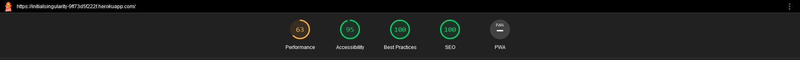
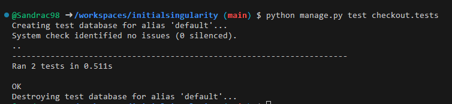

Initial Singularity was tested for responsiveness using the Google Chrome browser, the Chrome  Developer Tools, Firefox and Developer Tools to check the different screen sizes. Additionally, the website was also tested on a Samsung Galaxy a52 5G using the Samsung internet browser. No errors were found during the testing process.

- [Code Validation](#code-validation)
  - [W3C HTML Validator](#w3c-html-validator)
  - [W3C CSS Validator](#w3c-css-validator)
  - [JSHINT Javascript Code Quality Tool](#jshint-javascript-code-quality-tool) 
- [Lighthouse](#lighthouse-score)
- [User Stories Testing](#user-stories-testing)
- [Manual Testing](#manual-testing)
- [Automated Testing](#automated-testing)

# Code Validation

## W3C HTML Validator
 - Code was checked using https://validator.w3.org/ 

 

## W3C CSS Validator
-  Code was checked using https://jigsaw.w3.org/css-validator/ 
  

## JSHINT Javascript Code Quality Tool

# Lighthouse score. 

## User Stories Testing

**User Registration and Authentication**
   - Test Scenario: As a new user, I want to create an account and log in.
   - Expected Result: Successfully created an account and logged in.

2. **Product Listings**
   - Test Scenario: As a user, I want to browse the catalog and view product details.
   - Expected Result: Able to view a list of products with detailed descriptions and images.

3. **Product Search and Filters**
   - Test Scenario: As a user, I want to search for a specific product using keywords and apply filters.
   - Expected Result: Successfully searched for products and applied filters to narrow down choices.

4. **Shopping Cart**
   - Test Scenario: As a user, I want to add products to my cart and proceed to checkout.
   - Expected Result: Added products to the cart and completed the checkout process.

5. **Payment Integration**
   - Test Scenario: As a user, I want to make a payment for my order.
   - Expected Result: Successfully made a payment using the integrated payment gateway.

6. **Order History**
   - Test Scenario: As a user, I want to view my order history and order details.
   - Expected Result: Accessed order history with order status and details.

7. **Responsive Design**
   - Test Scenario: As a user, I want to access the website from different devices.
   - Expected Result: The website is usable and visually appealing on various devices.

8.  **Navigation Menu and Layout**
   - Test Scenario: As a user, I want a structured layout and easy navigation.
   - Expected Result: Accessed different sections of the website using the navigation menu.

### Manual Testing

- **Browser Compatibility Testing**
  - Tested on Firefox, Chrome, and Samsung A52 5G browser to ensure compatibility.

- **User Registration and Authentication**
  - Manually tested user registration, login, and logout processes.

- **Product Listings**
  - Manually verified that product listings display correctly with descriptions and images.

- **Product Search and Filters**
  - Checked the functionality of product search and filter options.

- **Shopping Cart and Checkout**
  - Added products to the cart, proceeded through the checkout process, and made test payments.

- **Order History**
  - Checked the user's order history and order details.

- **Responsive Design**
  - Tested the website's responsiveness on different devices, including mobile.

- **Navigation Menu and Layout**
  - Checked the structure and navigation menu functionality.

# Automated testing
I've conducted tests for views, forms, and models, and you can locate these tests in the tests.py file within the respective app's "tests" folder.

---

---

---

---

Back to [README.md](/README.md#testing)